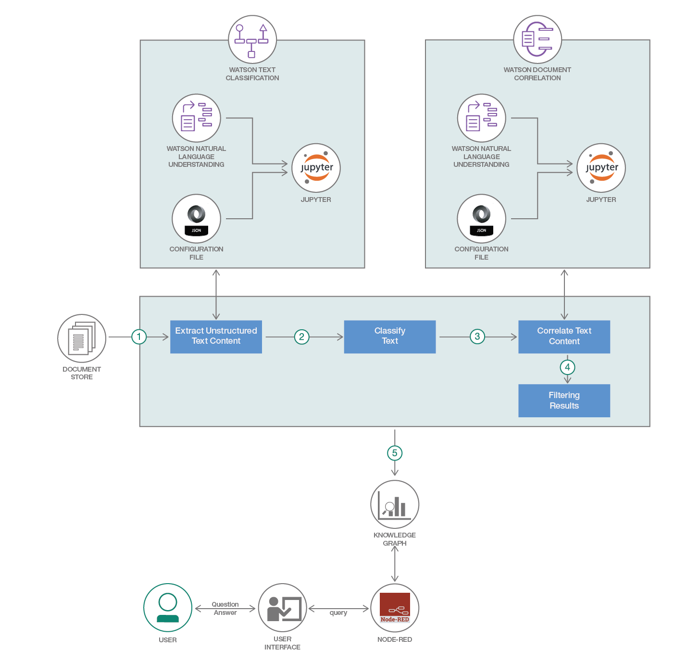
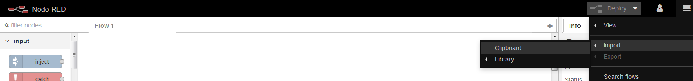
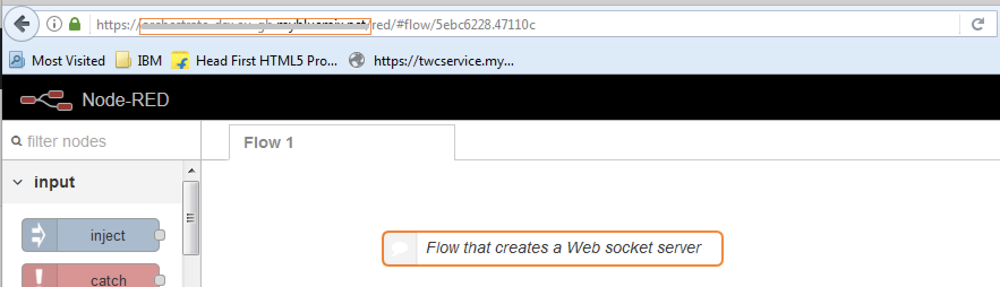
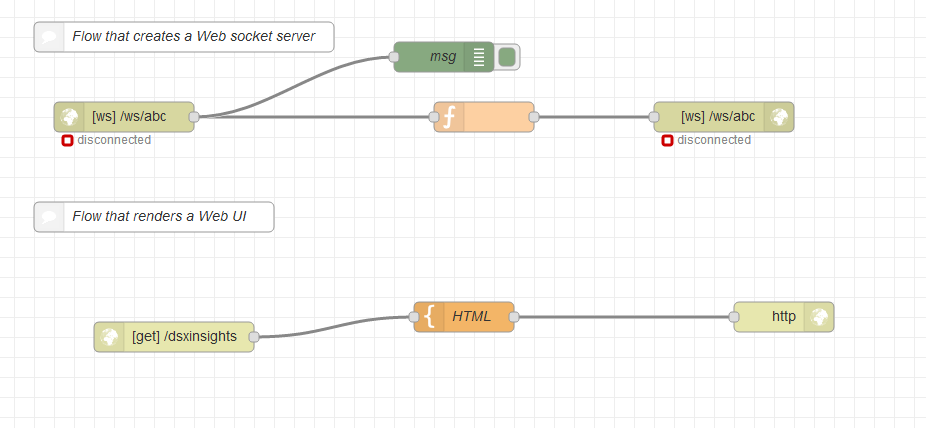
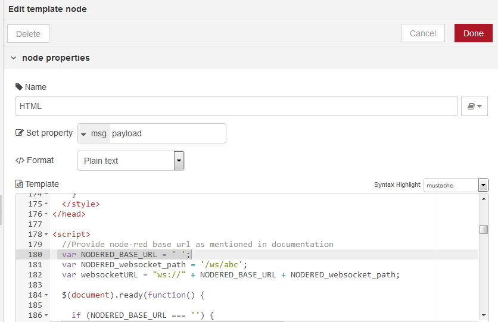
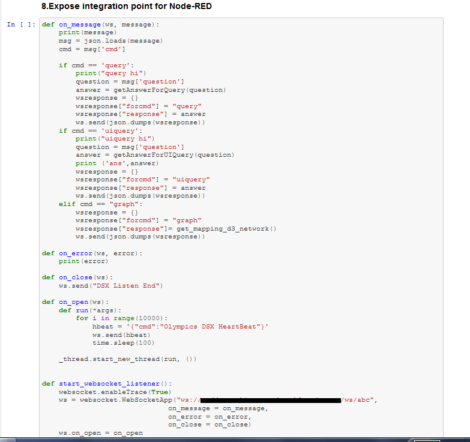
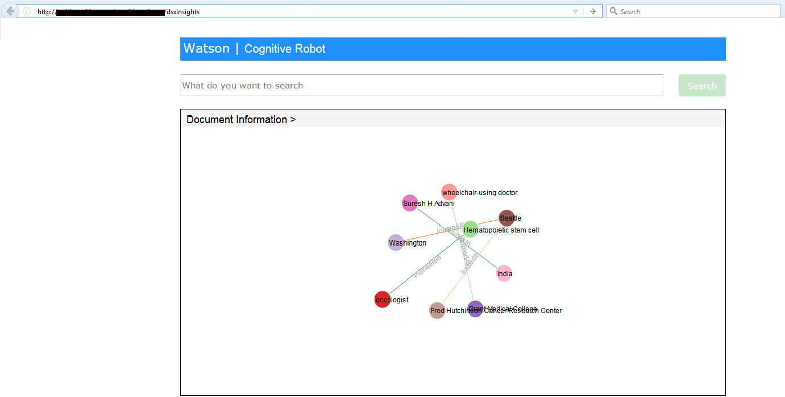

# Query Knowledge-base with Domain Specific Documents

This code pattern is in continuation of the composite pattern - [`build knowledge-base with domain-specific documents`](https://github.com/IBM/build-knowledge-base-with-domain-specific-documents). We saw how we can extract entities and relations from a word document that contains information in tables and text to build a knowledge graph.

After building the knowledge graph, the next step is fetch the required facts. Take the example of a document that contains details of the history of a cancer patient. We could the need the answer to the below questions and more:

* When was the cancer diagnosed? 
* What were the early symptoms of the cancer? 
* What is the history of the patient’s family? 
* What are the treatments given to the patient? 
* List of all the things patient is allergic to? 
* Which Oncologist is in charge of that patient? 

The problem lies in finding the context of the entities in the text string used for search, resolve the ambiguity of the text, formulating the query accordingly and provide the relevant query results fetched from the domain-specific Knowledge base. For instance, In a new york times article there is a mention of former US President Barack Obama as just 'OBAMA', how to make the algorithm understand it’s referring to the US president and not any other person. 

This Composite code pattern discusses an algorithm developed to resolve the challenges stated above. The algorithm uses the knowledge graph constructed in the code pattern [`build knowledge-base with domain-specific documents`](https://github.com/IBM/build-knowledge-base-with-domain-specific-documents). The Parts of Speech (PoS) Tagging is done on search text and fuzzy wuzzy string matching library was used to get the relevant answers. For details on the algorithm, check the section `Detailed Algorithm` of the documentation.

* The unstructured data is brought into a 3-tuple of entity-relationship-entity
* A knowledge graph is built out of the obtained entities and relationship
* A question is entered by the user on the UI.
* The question asked by the user through the UI is sent to the notebook through the Node Red. Node red helps in integrating the UI with notebook. 
* The question gets queried and a suitable response is sent back.
* The user receives the answer on the UI. 

## Video

## Included components

* [IBM Watson Studio](https://www.ibm.com/cloud/watson-studio): Analyze data using RStudio, Jupyter, and Python in a configured, collaborative environment that includes IBM value-adds, such as managed Spark.

* [IBM Cloud Object Storage](https://console.bluemix.net/catalog/infrastructure/cloud-object-storage): An IBM Cloud service that provides an unstructured cloud data store to build and deliver cost effective apps and services with high reliability and fast speed to market. 

* [Watson Natural Language Understanding](https://console.bluemix.net/catalog/services/natural-language-understanding/?cm_sp=dw-bluemix-_-code-_-devcenter): An IBM Cloud service that can analyze text to extract meta-data from content such as concepts, entities, keywords, categories, sentiment, emotion, relations, semantic roles, using natural language understanding.

* [Node-RED](https://console.bluemix.net/catalog/starters/node-red-starter): Node-RED is a programming tool for wiring together APIs and online services.

## Featured technologies

* [Data Science](https://medium.com/ibm-data-science-experience/): Systems and scientific methods to analyze structured and unstructured data in order to extract knowledge and insights.

<!-- # Watch the Video -->

# Steps

Follow these steps to setup and run this developer journey. The steps are
described in detail below.

1. [Sign up for Watson Studio](#1-sign-up-for-watson-studio)
1. [Create IBM Cloud services](#2-create-ibm-cloud-services)
1. [Import the Node-RED flow](#3-import-the-node-red-flow)
1. [Note the websocket URL](#4-note-the-websocket-url)
1. [Update the websocket URL](#5-update-the-websocket-url-in-html-code)
1. [Update the websocket URL in Notebook](#6-update-the-websocket-url-in-notebook)
1. [Accessing the user interface](#7-accessing-the-user-interface)
1. [Set up the Notebook](#set-up-the-notebook)
1. [Detailed Algortihm](#detailed-algorithm)

## 1. Sign up for Watson Studio

Sign up for IBM's [Watson Studio](http://dataplatform.ibm.com/). By creating a project in Watson Studio a free tier ``Object Storage`` service will be created in your IBM Cloud account

## 2. Create IBM Cloud services

Create the IBM Cloud services required for the individual code patterns:

  * [Extend Watson text classification](https://github.com/IBM/watson-document-classifier/#2-create-ibm-cloud-services)
  * [Orchestrate data science workflows using Node-RED](https://github.com/IBM/node-red-dsx-workflow#2-create-ibm-cloud-services)

## 3. Import the Node-RED flow
* [Clone this repo](https://github.com/IBM/query-knowledge-base-with-domain-specific-documents).
* Navigate to the [knowledge_graph_insights.json](https://github.com/IBM/query-knowledge-base-with-domain-specific-documents/tree/master/node-red-flow/knowledge_graph_insights.json).
* Open the file with a text editor and copy the contents to Clipboard.
* On the Node-RED flow editor, click the Menu and select `Import` -> `Clipboard` and paste the contents.

 
 
 #### Deploy the Node-RED flow by clicking on the `Deploy` button

## 4. Note the websocket URL

The websocket URL is ws://`<NODERED_BASE_URL>`/ws/abc  where the `NODERED_BASE_URL` is the marked portion of the URL in the above image.
### Note:
An example websocket URL for a Node-RED app with name `myApp` is `ws://myApp.mybluemix.net/ws/abc`, where `myApp.mybluemix.net` is the `NODERED_BASE_URL`. 

The NODERED_BASE_URL may have additional region information i.e. `eu-gb` for the UK region. In this case `NODERED_BASE_URL` would be: `myApp.eu-gb.mybluemix.net`. 

In this Code pattern, we address the problem of extracting knowledge out of text and tables in word documents. A knowledge graph is built from the knowledge extracted making the knowledge queryable.

This pattern demonstrates a methodology to derive insights with IBM Cloud, Watson services, Python NLTK and IBM Data Science experience.

## 5. Update the websocket URL in HTML code
Click on the node named `HTML`.

Click on the HTML area and search for `ws:` to locate the line where the websocket URL is specified. 
Update the websocket URL with the base URL that was noted in the [Section 4](#4-note-the-websocket-url): 	

	var websocketURL = "ws://" + NODERED_BASE_URL + NODERED_websocket_path;
	

Click on `Done` and re-deploy the flow.

## 6. Update the websocket URL in notebook

Update your NODERED BASE URL in the notebook, as shown below.

Add your NODERED BASE URL as shown below : 	

	"ws://" + NODERED_BASE_URL + "/ws/abc"

## 7. Accessing the user interface
Open a new tab and enter the following url with your NODERED_BASE_URL:

	http://NODERED_BASE_URL/dsxinsights
	

Now you are ready to search in the search text area.

# Set up the Notebook 
Follow the instructions given in the [`build knowledge-base with domain-specific documents`](https://github.com/IBM/build-knowledge-base-with-domain-specific-documents) to set-up the Notebook on IBM Data Science Experience. The only change is use this updated[ Notebook](https://github.com/IBM/query-knowledge-base-with-domain-specific-documents/blob/master/notebook/Knowledge_graph_insights.ipynb).

# Detailed Algorithm

Problem Statement: Given an unstructured document, the system must be able to answer questions based on this document.  This code pattern solves this problem using the following methodology:

1. Data Conversion: The given unstructured data maybe of the form of free floating text or in the form of a table. The algorithm extract raw text from the doc file and converts table contents to HTML and further a json, to extract information. Python mammoth was the library used to perform all the data conversions.

2. Building a Knowledge Graph: After all the information has been processed and extracted we require to identify the important entities and their relations. This is required so as to represent the obtained the information as a graph. The Entities and Relations are extracted using Watson NLU api along with augmented rules provided by the user. This graph will represent the important entities as nodes and the relationship between these nodes as relation edges. It is also known as a knowledge graph.

3. Extraction of Entities and Relationships: The problem is now reduced to the system being able to answer questions by querying the knowledge graph built in the previous step. When the user poses a question the questions is first represented in the form of POS tags. Using chunking we extract the nouns as entities and the verbs as relations.

4. Querying Knowledge Graph for Answers: The obtained knowledge graph is made a table of triplets- (node1, node2, relations). Using fuzzy logic techniques the entities and relations obtained from the question is searched for in the knowledge graph table. Thus, if a question is contains either one of the nodes and the relation, the answer to the question is bound to the other node. This way we can answer questions from any given document.

# Troubleshooting

[See DEBUGGING.md.](DEBUGGING.md)

# License

[Apache 2.0](LICENSE)
